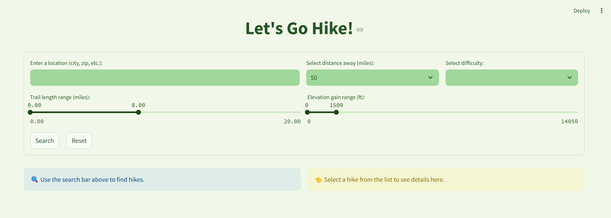
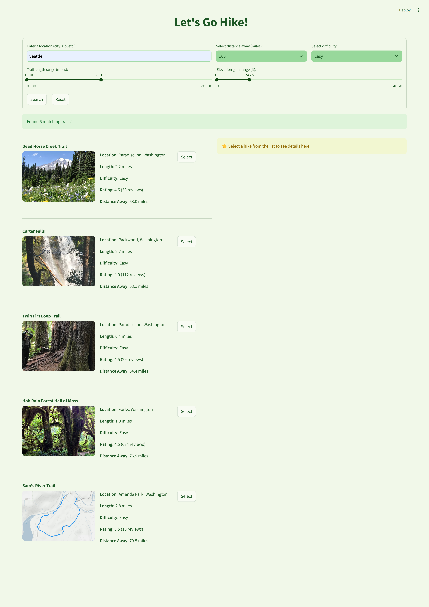

# Examples

## Getting Started

Follow the installation and setup instructions in the README

### 1. Clone the Repository
```bash
git clone https://github.com/harshilshah4251/LetsGoHike.git
cd LetsGoHike
```
### 2. Create and activate the virtual environment
``` bash
python3 -m venv letsgohikeenv
source letsgohikeenv/bin/activate  # Mac/Linux
.\letsgohikeenv\Scripts\activate   # Windows
```
### 3. Install Dependencies
``` bash
pip install -r requirements.txt
```
### 4. Run the Application
``` bash
python -m streamlit run letsgohike/app.py
```

## Search bar and Starting page

The app should start up with the search bar shown below



The user must enter a location with options for how they would like to filter for trails.

Click 'Search' to get a list of relevent hikes sorted by nearest to given location.

## Hike List

The following list of hikes is displayed, for easy hikes within 100 miles of Seattle, WA



Use the 'Select' button to find out more about the hike in the hike description section

## Hike Details & Description

After clicking the 'Select' button, details on the hike are displayed on the right-hand side.


Details include:
* a LLM generated description of the hike
* a picture from the hike
* a 3-day weather forcast with weather for every 3 hours
* a map showing the trail head
* and a LLM generated hike plan for the trail

## Further Navigation in the app

Click 'Select' on another hike to see it's details

***or***

Change search parameters in the search bar and click 'Search' to generate a new list of hikes

***or***

Reset the search parameters using the 'Reset' button to start fresh

*Hope you enjoy this app! Happy Trails!*
